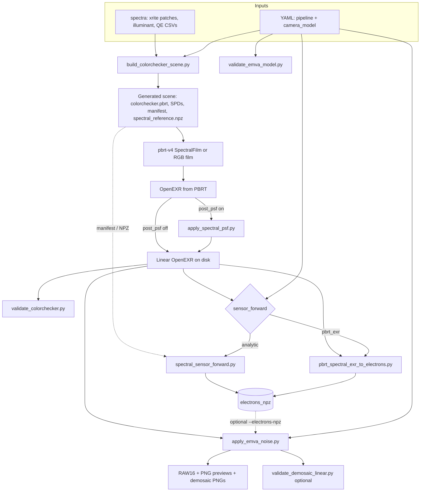

# Open Cam: PBRT Spectral ColorChecker + EMVA Noise

This repository builds a physically-motivated camera simulation workflow around:

- Spectral scene rendering with `pbrt-v4`
- GretagMacbeth/X-Rite 24-patch ColorChecker input spectra
- QE-aware, YAML-parameterized EMVA-style sensor/noise post-processing
- Camera-model driven configuration (`lens + noise + CFA`) via `config/camera_models/*.yaml`

Current milestone status:

- ColorChecker scene generation from spectral CSVs: implemented
- PBRT rendering pipeline to linear EXR: implemented
- YAML-driven EMVA noise post-step (RAW + PNG stack outputs): implemented
- Optics: PBRT `RealisticCamera` + lens file from camera model; optional post-render Gaussian PSF from camera model (`lens.post_psf`)

### Camera model updates

- Per-camera QE curves were extracted from `spectra/QE/Spectral_sensitivities_IE.xlsx` into `spectra/QE/cameras/<camera_slug>/`.
- Camera model YAMLs were generated under `config/camera_models/` (see `config/camera_models/INDEX.md`).
- EMVA parameter summaries are available in:
  - `config/camera_models/EMVA_SUMMARY.csv`
  - `config/camera_models/EMVA_SUMMARY.md`
- Additional default QE variants are available for rapid experimentation:
  - `config/camera_models/default_rccb.yaml`
  - `config/camera_models/default_rccg.yaml`
  - `config/camera_models/default_ryycy.yaml`
  - `config/camera_models/default_cmy.yaml`
  - `config/camera_models/default_rggcy.yaml`
- These four are **RGB-proxy mappings** of non-RGB filter families using `spectra/QE/interpolated/*` so they remain compatible with the current RGB-centered pipeline.

### Optics (two knobs)

1. **Traced lens (render time)** — Set `lens.camera` to `realistic` in the camera model file (`config/camera_models/default.yaml` by default). The default lens asset is `scenes/lenses/wide_22mm.dat` (wide-angle prescription from the [pbrt-v4-scenes](https://github.com/mmp/pbrt-v4-scenes) lens set). Tune `lens.realistic_aperture_diameter_mm` and optionally `lens.realistic_focus_distance` (defaults to `cam_dist` when omitted). Rebuild the scene via `tools/build_colorchecker_scene.py`, **`run_pipeline.py`**, or **`scripts/generate_colorchecker_image.sh`**.

2. **Post PSF / MTF-style blur (CPU)** — Set `lens.post_psf.enabled` to `true` in the camera model and adjust `lens.post_psf.sigma_pixels`. This convolves every float channel in the multispectral EXR (including `S0.*`). If you use both traced lens and PSF, keep `sigma_pixels` small to avoid excessive double softening.

## Pipeline (block diagram)

End-to-end flow from measured spectra to simulated sensor output. Dashed edges are optional or configuration-dependent (`sensor_forward.mode` in `config/pipeline.yaml` chooses **analytic** vs **pbrt_exr**; EMVA can consume the multispectral EXR directly or precomputed `electrons_npz`). Pipeline YAML also controls scene-build/lens options and stage toggles.



**Orchestration:** `tools/run_pipeline.py` and **`scripts/generate_colorchecker_image.sh`** both read **`config/pipeline.yaml`** (override with **`PIPELINE_CONFIG`** for a custom YAML path). Camera model selection is: CLI `--camera-model-config` override, otherwise exactly one of `paths.camera_model_name` or `paths.camera_model_config` (setting both is rejected). They apply camera-model lens settings to `build_colorchecker_scene.py` and run optional PSF when **`lens.post_psf.enabled: true`** (in-place overwrite of **`paths.exr_out`** before validation and downstream steps).

Pipeline-level overrides in `config/pipeline.yaml`:

- `realistic_focus_distance_override`: when set, overrides `lens.realistic_focus_distance` during scene build (`RealisticCamera` only).
- `exposure_time_override_s`: when set, overrides `sensor.integration_time_s` for `spectral_sensor_forward.py`, `pbrt_spectral_exr_to_electrons.py`, and `apply_emva_noise.py`.
- `noise.preview_no_normalize`: when `true`, disables percentile white-point normalization for preview PNGs (`apply_emva_noise.py --preview-no-normalize`).

**Supporting modules:** `tools/exr_multispectral.py` reads `S0.*` EXR channels; `tools/sensor_radiometry.py` integrates photon flux; `tools/pipeline_shell_env.py` exports shell variables from the pipeline YAML for the bash script.

## Repository Layout

- `spectra/`: reflectance (`xrite`), illuminants, QE curves; optional Joensuu matte Munsell under `spectra/munsell/`
- `tools/build_colorchecker_scene.py`: generates scene + SPD files
- `scenes/lenses/`: optional `RealisticCamera` lens descriptions (e.g. `wide_22mm.dat`)
- `scenes/generated/`: generated PBRT scene and SPD assets
- `out/`: render outputs and noisy sensor outputs
- `config/camera_models/default.yaml`: default camera model containing lens + sensor/noise + CFA + sensor-forward + validation settings
- `config/camera_models/default_rccb.yaml`, `default_rccg.yaml`, `default_ryycy.yaml`, `default_cmy.yaml`, `default_rggcy.yaml`: default non-RGB QE variant models (RGB-proxy mappings)
- `config/camera_models/INDEX.md`: generated list of camera-specific models extracted from `spectra/QE/Spectral_sensitivities_IE.xlsx`
- `config/camera_models/EMVA_SUMMARY.csv`, `config/camera_models/EMVA_SUMMARY.md`: tabular summary of EMVA/noise parameters across models
- `spectra/QE/cameras/`: per-camera extracted QE curves (`QE_red.csv`, `QE_green.csv`, `QE_blue.csv`)
- `tools/apply_emva_noise.py`: post-render EMVA/noise processor
- `tools/apply_spectral_psf.py`: optional post-render PSF blur on multispectral EXR (`lens.post_psf` in camera model)
- `tools/spectral_sensor_forward.py`: spectral → electrons forward model (analytic chart path)
- `tools/pbrt_spectral_exr_to_electrons.py`: SpectralFilm EXR → electrons (`sensor_forward.mode: pbrt_exr`)
- `tools/exr_multispectral.py`: read/write multispectral OpenEXR channels (`S0.*`)
- `tools/pipeline_shell_env.py`: export env vars from `config/pipeline.yaml` for `generate_colorchecker_image.sh`
- `tools/validate_colorchecker.py`: quick validation/sanity checks
- `tools/validate_emva_model.py`: EMVA-style temporal noise vs analytic + datasheet targets
- `tools/run_pipeline.py`: one-command orchestrator for full pipeline
- `scripts/generate_colorchecker_image.sh`: bash end-to-end runner (same stages as `run_pipeline.py`, driven by `tools/pipeline_shell_env.py`)
- `config/pipeline.yaml`: orchestration preset (tools, outputs, stage toggles, and selected `camera_model_name` or `camera_model_config`)
- `third_party/pbrt-v4/`: vendored PBRT source
- `docs/BUILD_PBRT.txt`: PBRT build notes
- `tools/munsell_mat.py`: shared loader for `munsell380_800_1.mat` (labels, 380–800 nm grid, optional `C` table)
- `tools/extract_munsell_mat.py`: export per-chip CSV + optional NPZ + manifest from that MAT file
- `tools/munsell_mat_to_sqlite.py`: build **`spectra/munsell/munsell.sqlite`** — queryable chips + long-format spectra for summaries and ad-hoc pulls (stdlib **SQLite** + **scipy**)

## Munsell matte spectra (Joensuu, optional)

Measured reflectance for **1269** matte chips (**380–800 nm**, 1 nm step) is distributed as `munsell380_800_1.mat` in `spectra/munsell/` (format and matrix layout: `spectra/munsell/README.txt`). A Zenodo bundle that includes this dataset is [Munsell spectrophotometer data (Zenodo)](https://zenodo.org/records/3269912).

Two export paths:

1. **SQLite (recommended for exploration)** — one file, SQL summaries, joins (Python `sqlite3`, [Datasette](https://datasette.io/), DuckDB `ATTACH`, …). Default output: `spectra/munsell/munsell.sqlite` (overwritten each run).

```bash
venv/bin/python tools/munsell_mat_to_sqlite.py --summary
sqlite3 spectra/munsell/munsell.sqlite "SELECT hue, COUNT(*) AS n FROM chip WHERE hue IS NOT NULL GROUP BY hue ORDER BY n DESC LIMIT 5;"
```

Use **`--mat`** / **`--db`** to override paths; **`--max-chips N`** for a small test DB.

2. **Flat CSV / NPZ** — one CSV per chip under `spectra/munsell/csv/` (same `wavelength_nm,value` convention as `spectra/xrite/`), optional combined NPZ:

```bash
venv/bin/python tools/extract_munsell_mat.py --npz spectra/munsell/munsell_all.npz
```

Run tools as **`venv/bin/python tools/<script>.py`** from the repo root so `tools/` is on `sys.path` for `munsell_mat` imports.

### Generate grouped Munsell scenes

`tools/build_munsell_scenes.py` reads `spectra/munsell/munsell380_800_1.mat` and generates a **series of scenes grouped by hue family** (`R, YR, Y, GY, G, BG, B, PB, P, RP, N` when available).

Within each hue-family scene:

- patches are ordered deterministically by `value`, then `chroma`, then hue step (fallback: MAT index),
- layout uses a fixed rectangular grid (`--columns` controls width),
- this is the "equivalent" of arranging by hue/saturation for per-family sheets.

Default output root:

```text
scenes/generated/munsell/
```

Quick generation example:

```bash
venv/bin/python tools/build_munsell_scenes.py --film spectral --columns 10 --hues R,YR,Y
```

Render all generated Munsell scenes:

```bash
for p in scenes/generated/munsell/*/munsell_*.pbrt; do
  third_party/pbrt-v4/build/pbrt "$p"
done
```

Pipeline integration (optional): set `paths.scene_builder` to `tools/build_munsell_scenes.py` in `config/pipeline.yaml`, point `paths.scene_file` to one generated Munsell scene, and pass builder-specific flags via `render.builder_extra_args`.

## 1) Build PBRT

See `docs/BUILD_PBRT.txt` for details.

CPU-only build:

```bash
cd third_party/pbrt-v4
git submodule update --init --recursive
env -u PBRT_OPTIX_PATH cmake -S . -B build -DCMAKE_BUILD_TYPE=Release
cmake --build build -j$(nproc)
```

Binary path:

```bash
third_party/pbrt-v4/build/pbrt
```

## 2) Create/Activate Python Environment

```bash
python3 -m venv venv
venv/bin/pip install -r requirements.txt
```

Dependencies include **NumPy**, **PyYAML**, **imageio**, **OpenEXR** (multispectral EXR), and **scipy** (Joensuu Munsell `.mat` import for `extract_munsell_mat.py` / `munsell_mat_to_sqlite.py`).

## 3) Generate Spectral ColorChecker Scene

Standalone `tools/build_colorchecker_scene.py` defaults **`--light-scale`** to **`2.0`**. When you use **`run_pipeline.py`** or **`scripts/generate_colorchecker_image.sh`**, **`render.light_scale`** from **`config/pipeline.yaml`** is passed through instead (so one place controls scripted runs).

```bash
venv/bin/python tools/build_colorchecker_scene.py
```

Optional exposure tuning at scene-render stage (standalone CLI):

```bash
venv/bin/python tools/build_colorchecker_scene.py --light-scale 2
```

Important: PBRT expects the scene (`.pbrt`) as input, not `.exr`.

```bash
third_party/pbrt-v4/build/pbrt scenes/generated/colorchecker.pbrt
```

### Patch layout and camera axes

pbrt-v4 `LookAt` sets `right = normalize(cross(up, view))`. In the default scene the eye sits on **+Z**, the target is the origin, and `up` is **+Y**, so **camera +X aligns with world −X**. Moving right across the image therefore moves toward **more negative** world X on the chart plane.

To match the usual X-Rite diagram (patch 01 dark skin at the **top-left** of the frame), `tools/build_colorchecker_scene.py` mirrors each patch quad in world X while keeping patch indices and CSV order unchanged. The same convention is used in `tools/spectral_sensor_forward.py` (negated horizontal NDC when mapping pixels to world X) and in `tools/validate_demosaic_linear.py` for interior crops. If you change `LookAt` or the camera basis, regenerate the scene and keep these mappings consistent.

Output EXR (depends on `render.film` in `config/pipeline.yaml`; default is multispectral):

```text
out/colorchecker_spectral.exr
```

Use `out/colorchecker.exr` if you set `render.film: rgb` in the pipeline YAML.

**Multispectral film (pbrt-v4 `SpectralFilm`):** PBRT writes OpenEXR with RGB plus `S0.<lambda>` buckets (360–830 nm span). Install **`OpenEXR`** (`pip install -r requirements.txt`); plain imageio collapses these files to RGB and drops spectral planes. **`tools/exr_multispectral.py`** reads separate channels for **`tools/apply_emva_noise.py`**: `processing.linear_exr_mode: rgb` uses true R,G,B plus mean QE scaling; `integrate_qe` multiplies bucket radiance by your QE CSVs and trapezoid dλ weights (no extra `qe_vec` multiply). If the pipeline uses **`--electrons-npz`**, the EXR is not the signal source for RGB reconstruction but is still referenced in `run_stats.json`; set **`EMVA_FROM_EXR=1`** with **`scripts/generate_colorchecker_image.sh`** to run EMVA from the multispectral EXR only (omit `--electrons-npz`).

## 4) Validate Render/Spectral Sanity

```bash
venv/bin/python tools/validate_colorchecker.py
```

This script checks neutral patch ordering and reports EXR stats (via PBRT `imgtool` when available).

### EMVA temporal-noise validation (datasheet / calibration)

`tools/validate_emva_model.py` checks that the **shot + read + electron floor clip** path used in `apply_emva_noise.py` matches closed-form predictions (dark frame uses the folded-normal mean for `max(0, read)`; mid/high signal uses Poisson + Gaussian variance in DN). Mean checks use an effective tolerance of `max(mean_abs_dn_atol, 3*sqrt(pred_var/n_trials))` to avoid false failures from Monte Carlo sampling noise at strict fixed tolerances. It also compares active camera-model noise parameters to the optional **`validation.datasheet`** block so you can fail CI when the model drifts away from measured **K**, **σ_d**, **full well**, and **black level**.

```bash
venv/bin/python tools/validate_emva_model.py
```

Set `datasheet.enabled: false` to skip parameter comparison while iterating. Replace the `datasheet` numbers with values from an EMVA1288 report or vendor data sheet when calibrating a real sensor, and set `validation.datasheet.source` to record provenance. If `source.emva_param_method` is heuristic and `validation.datasheet.source` is missing, datasheet comparison is skipped and reported as such.

For apples-to-apples comparisons across conventions, `validation.datasheet` also supports:

- `gain_convention`: `e_per_dn` (default) or `dn_per_e`
- `bit_depth`: datasheet ADC bit depth (used to scale datasheet black level into model bit depth)

The full report is written to `out/emva_validation_report.json` (path overridable with `--json-out`).

With `validate_emva.enabled: true` in `config/pipeline.yaml`, `tools/run_pipeline.py` runs this step after render validation (it does not require an EXR).

## 5) Run EMVA Noise Post-Processor

```bash
venv/bin/python tools/apply_emva_noise.py
```

Reads:

- `config/camera_models/default.yaml`
- `out/colorchecker_spectral.exr` (default linear EXR input; override with `tools/run_pipeline.py` / `--linear-exr`)

Writes:

- RAW16: `out/colorchecker_noisy.raw16`
- PNG stack: `out/colorchecker_noisy_png/`
  - `clean_rgb8.png`
  - `noisy_rgb8.png`
  - `noisy_R_16.png`, `noisy_G_16.png`, `noisy_B_16.png`
  - `run_stats.json`

## 6) One-command orchestration

All presets live in **`config/pipeline.yaml`**. There are no alternate pipeline YAML files in this repo.

Quick camera switch by name:

```yaml
paths:
  camera_model_name: sony_alpha_6600
```

The name maps to `config/camera_models/<camera_model_name>.yaml`.

### Python: `run_pipeline.py`

Runs scene build → PBRT → optional PSF (`lens.post_psf` in camera model) → validate → spectral forward (if enabled) → EMVA → optional demosaic metrics.

```bash
venv/bin/python tools/run_pipeline.py --config config/pipeline.yaml
```

Dry-run (prints commands only):

```bash
venv/bin/python tools/run_pipeline.py --config config/pipeline.yaml --dry-run
```

Each run writes a manifest in `out/`:

```text
out/run_pipeline_<timestamp>.json
```

The manifest records commands, key parameters, and output hashes for reproducibility.
When `validate_demosaic.enabled` is true in the pipeline config, the run also writes
`out/demosaic_linear_metrics.json` and records its hash in the run manifest.

### Bash: `scripts/generate_colorchecker_image.sh`

Same logical stages as `run_pipeline.py` (including optional `validate_emva`), using **`tools/pipeline_shell_env.py`** to read **`config/pipeline.yaml`** (or **`PIPELINE_CONFIG`**). Optional seed argument: **`scripts/generate_colorchecker_image.sh 0`**.

### Sensor forward (electrons before EMVA)

When **`sensor_forward.enabled: true`**, the pipeline can build **`paths.sensor_forward_electrons_npz`** before EMVA.

- **`sensor_forward.mode: pbrt_exr`** — integrate the rendered spectral EXR with **`tools/pbrt_spectral_exr_to_electrons.py`** (requires **`render.film: spectral`** and a matching **`paths.exr_out`**).
- **`sensor_forward.mode: analytic`** — **`tools/spectral_sensor_forward.py`** uses chart SPDs and the manifest; PBRT can still be RGB-only if you only need the render for previews.

Example (defaults in-repo often enable both `enabled` and `pbrt_exr`):

```yaml
sensor_forward:
  enabled: true
  mode: pbrt_exr
```

With **`--electrons-npz`**, **`apply_emva_noise.py`** uses the NPZ; with **`EMVA_FROM_EXR=1`** and the shell script, EMVA can be driven from the EXR only.

For an RGB-only PBRT render with **analytic** electrons (no `pbrt_spectral_exr_to_electrons` step), edit **`config/pipeline.yaml`**: set `render.film: rgb`, `paths.exr_out` to e.g. `out/colorchecker.exr`, and `sensor_forward.mode: analytic`.

The camera model `sensor_forward.model` section supports a **legacy** scale (`electrons_scale`) or **photon_counting** mode: spectral irradiance is converted with `photon_flux_density_from_irradiance` in `tools/sensor_radiometry.py`, using `irradiance_scale_W_m2nm_per_unit` and (when the scene manifest includes `lighting.distant`) **cosine shading** for the distant light. Optional **cos^4** vignetting is controlled by `vignetting_cos4`. Regenerate the scene with `tools/build_colorchecker_scene.py` so `colorchecker_manifest.json` includes the `lighting` block.

For lux-based radiometric targeting in photon-counting mode, set:

- `model.calibration.target_illuminance_lux` (e.g. `50`)
- optionally `model.calibration.illuminant_override_csv` (e.g. a D65 SPD CSV)

The forward model then rescales irradiance so `683 * ∫ E_e(λ) V(λ) dλ` matches the requested lux.

In the camera model `cfa` section, set `enabled: true` to mosaic RGB electrons to one channel per pixel (RGGB / BGGR / GRBG / GBRG) **before** shot, read, and FPN noise; `colorchecker_noisy.raw16` is then a single Bayer plane. `cfa.demosaic` accepts `true`/`false` or `"bilinear"` (only bilinear is implemented currently). With demosaic enabled, the tool writes `clean_demosaic_rgb8.png` and `noisy_demosaic_rgb8.png` (DN domain, reflect-padded bilinear). Set `demosaic_srgb: true` to apply the sRGB display gamma to those two demosaic previews only (linear stretch to [0,1] per channel, then IEC 61966-2-1 OETF); RAW and other PNGs stay linear in DN.

`noise.adc.clipping` is operational: when `true` (default), electron and DN values clip to full-well/ADC range; when `false`, only lower-bound clipping is applied before preview mapping.

Camera-model metadata fields (`schema_version`, `model.display_name`, `source.*`) are currently documentation/provenance only and do not alter runtime behavior.

To validate demosaic numerically in linear DN space against the pre-CFA RGB reference:

```bash
venv/bin/python tools/validate_demosaic_linear.py --repo-root . --json-out out/demosaic_linear_metrics.json
```

Run demosaic regression tests:

```bash
PYTHONPATH=tools:. venv/bin/python -m unittest discover -s tests -v
```

## Exposure Controls and Common Confusion

There are two separate exposure controls:

1. Scene/render exposure (`build_colorchecker_scene.py`)
   - `--light-scale` controls PBRT light intensity in scene generation.
2. Sensor-stage exposure (`apply_emva_noise.py`)
   - `processing.exposure_scale_e_per_unit` in YAML
   - or CLI override `--exposure-scale`
   - optional normalization mode: `--auto-exposure`
   - when `--electrons-npz` is supplied, this RGB->QE exposure mapping is bypassed
     and EMVA noise is applied directly to provided electrons.

By default, the EMVA tool is configured to preserve EXR scene brightness:

- `processing.auto_exposure: false`
- `processing.exposure_scale_e_per_unit: 1.0`

Preview PNGs are display-mapped separately from RAW physics:

- black point = `black_level_DN`
- white point = configurable percentile (`--preview-percentile`, default `99.5`)
- set `noise.preview_no_normalize: true` in `config/pipeline.yaml` (or pass `--preview-no-normalize`) to map previews against full ADC range instead of percentile normalization

If previews look too dark/bright, adjust `--preview-percentile` first before changing sensor physics.

## Example end-to-end runs

```bash
venv/bin/python tools/run_pipeline.py --config config/pipeline.yaml
```

```bash
scripts/generate_colorchecker_image.sh
```

## Notes on Physical Accuracy

PBRT v4 uses a small fixed number of sampled wavelengths per path in stock builds.
For strict QE/filter/hyperspectral analysis, prefer dense spectral integration in post-processing in addition to PBRT renders.
