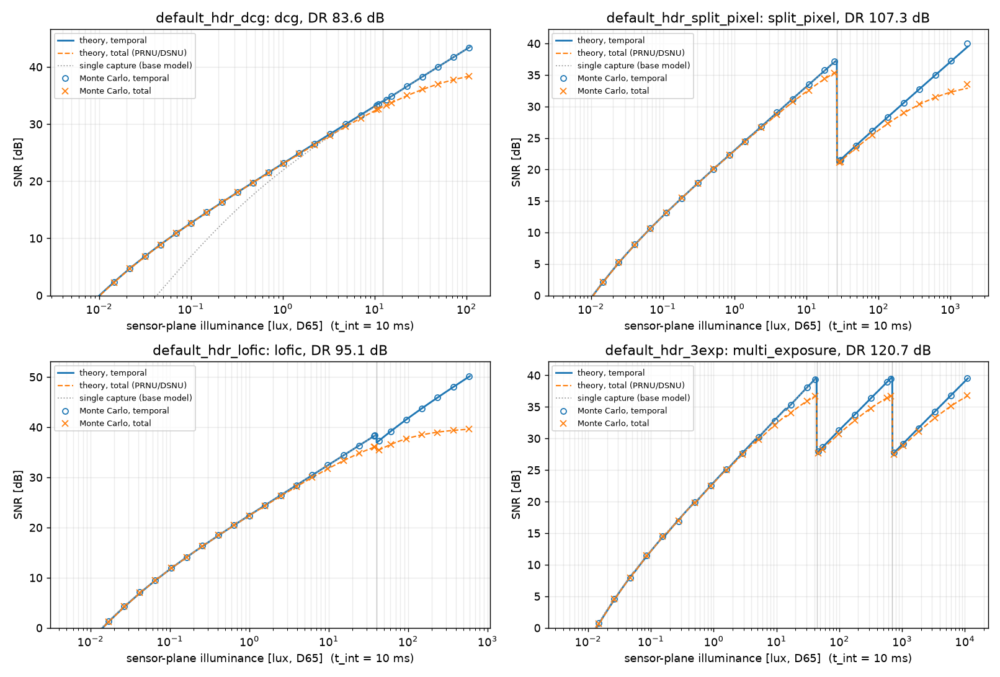

# HDR pixel architectures (opt-in)

`tools/hdr_pixel.py` adds dual conversion gain (DCG), split pixel (large + small
photodiode), LOFIC and sequential multi-exposure pixels to the EMVA sensor model
(`tools/apply_emva_noise.py`), with an SNR-aware merge, optional PWL companding,
analytic SNR theory and Monte Carlo validation. It is **off by default**: without
`noise.hdr.enabled: true` the noise model and its outputs are byte-identical to before
(regression test `tests/test_hdr_pixel.py::TestPipelineHook::test_disabled_hdr_is_bit_identical_to_no_hdr_block`).

## Usage

```bash
# example recipes: default_hdr_dcg, default_hdr_split_pixel, default_hdr_lofic, default_hdr_3exp
venv/bin/python tools/apply_emva_noise.py \
  --camera-model-config config/camera_recipes/default_hdr_3exp.yaml \
  --linear-exr out/highway_spectral.exr   # writes out/colorchecker_noisy.raw16 + out/colorchecker_noisy_hdr/
# validation (analytic vs Monte Carlo) + SNR-vs-illuminance figure
venv/bin/python tools/validate_hdr_model.py --json-out out/hdr_validation/hdr_validation.json \
  --figure out/hdr_validation/hdr_snr_vs_illuminance.png
```

Outputs (in addition to the usual `<raw_out>` and `<raw_out stem>_png/`), in `<raw_out stem>_hdr/`:

| file | content |
|---|---|
| `<capture>.raw16` | per-capture raw (e.g. `hcg`, `lcg`, `lpd`, `spd`, `exp0..N-1`), little-endian uint16, black level included |
| `hdr_linear.npz` | `hdr_e` (merged, dark-subtracted reference electrons, float32), `hdr_dn` (= `hdr_e / K_hdr`), `K_hdr_e_per_DN`, `companded_code` if companding |
| `hdr_metadata.json` | architecture graph, saturation/transition levels, timing, compander knees, dynamic range |

`<raw_out>` holds the companded code when `compand.enabled`, otherwise `hdr_dn` rounded
(clipped at 65535 with a warning if the linear HDR needs more than 16 bits). `run_stats.json`
gets an `hdr` block. Previews show `hdr_dn` (black level 0).

## Configuration (`noise.hdr` in a sensor model)

Unspecified per-readout values default to the single-exposure model (`noise.emva`, `noise.adc`).

```yaml
noise:
  hdr:
    enabled: true
    architecture: dcg | split_pixel | lofic | multi_exposure
    dcg:
      readout: dual            # dual: both gains read + merged; switch: per-pixel select
      photodiode_full_well_e: 25000
      hcg: {K_e_per_DN: 0.7, sigma_e: 1.5, full_well_e: 2800}   # full_well_e = FD swing
      lcg: {K_e_per_DN: 6.25, sigma_e: 8.0, full_well_e: 25000}
    split_pixel:
      large: {full_well_e, prnu_std_fraction, dsnu_std_e, dark_current_e_per_s, readouts: {lpd: {...}}}
      small: {sensitivity_ratio: 0.025, sensitivity_ratio_rgb: [r, g, b] (optional), full_well_e, ..., readouts: {spd: {...}}}
    lofic:
      photodiode_full_well_e: 8000
      capacitor_full_well_e: 112000
      capacitor_dark_current_e_per_s: 200
      hcg: {K_e_per_DN, sigma_e}                       # photodiode on FD, CDS
      lcg: {K_e_per_DN, sigma_e, ktc_capacitance_fF}   # PD + capacitor, no true CDS
    multi_exposure:
      exposure_ratios: [1.0, 0.0625, 0.00390625]       # t_i / sensor.integration_time_s
      inter_exposure_gap_s: 0.0
      readout: {K_e_per_DN, sigma_e, full_well_e}
      capture_electrons_npz: {exp1: out/short.npz}     # optional, or --hdr-capture-electrons
    merge: {method: snr_weighted | select, threshold_fraction: 0.9, hdr_K_e_per_DN: null}
    compand: {enabled: false, bit_depth: 12, black_level_DN: 64, knees: auto | [[0,0],[x1,y1],...], segments: 12}
```

Readout keys: `K_e_per_DN`, `sigma_e`, `full_well_e`, `bit_depth`, `black_level_DN`,
`ktc_capacitance_fF` (adds `sqrt(kTC)/q` in quadrature). Photodiode keys:
`full_well_e`, `prnu_std_fraction`, `dsnu_std_e`, `dark_current_e_per_s` (temperature-scaled
like the base model).

## Model

Per collector *j* (photodiode × integration window; response *r_j* relative to the
reference photodiode/exposure) and readout *k* (EMVA 1288 linear model per capture):

```
Q_j  = Poisson(r_j mu (1 + PRNU_j z) + D_j + DSNU_j z')
Q_pd = min(Q_j, FW_pd);  Q_ov = clip(Q_j - FW_pd, 0, C_ov)               (LOFIC)
q_k  = min(Q_pd [+ Q_ov + D_cap], FW_k) + N(0, sigma_k^2)
DN_k = clip(round(q_k / K_k + black_k), 0, 2^b_k - 1)
```

* **DCG**: both gains read the same charge (shared shot noise, independent read noise);
  HCG is limited by its floating-diffusion swing.
* **Split pixel**: independent photodiodes (independent shot noise and fixed patterns);
  the SPD sees `sensitivity_ratio` of the LPD signal (optionally per CFA channel).
* **LOFIC**: charge above the photodiode full well overflows into the capacitor; HCG reads
  only the photodiode, LCG reads photodiode + capacitor, with kTC noise of the combined
  capacitance because that signal has no true CDS (Akahane et al. 2006).
* **Multi-exposure**: sequential windows on one photodiode (`t_start_s` per capture,
  long first): independent shot noise, shared PRNU, dark signal and DSNU ∝ t_i.

**Merge.** Each readout gives `mu_k = ((DN_k - black_k) K_k - D_k) / r_k`. A readout drops
out when its measured charge exceeds `threshold_fraction` × its saturation (transition
threshold). The remaining estimates are combined with minimum-variance weights
`w = C⁻¹1 / 1ᵀC⁻¹1`, where `C` is the temporal covariance at a pilot signal (shot and dark
shot shared between readouts of one collector; read noise and `K²/12` per readout) — the
noise-optimal HDR weighting of Granados et al. (2010) / Hasinoff et al. (2010), generalised to
correlated readouts of one photodiode. `method: select` uses the single lowest-variance valid
readout (auto-switching sensor). The pilot is the most sensitive valid readout.

**PWL companding.** `knees: auto` builds a square-root-law curve: unity slope up to `a`, then
knees on `f(x) = a + 2√a(√x − √a)` (C¹ at `a`, `f(max) = 2^bits − 1 − black`), so the
decompanded step grows like the shot noise. Values below zero continue the first segment
below the pedestal. Theory adds `Δ_in²/12` per segment.

**Analytic SNR** (`hdr_pixel.theory_snr`): `SNR(mu) = mu / sqrt(wᵀ C w)` with the same
thresholds and weights evaluated at the mean signal; `include_spatial=True` adds PRNU/DSNU
(EMVA 1288 4.0 Linear §8.5 total SNR), `include_compander` the PWL quantisation. The SNR dip at
each transition is the step between the merged SNR just below and just above the threshold.

## Validation

`tools/validate_hdr_model.py` simulates 20 000 pixels per level with the same code path as the
pipeline. It estimates temporal variance EMVA-style from two frames with the same fixed
pattern (`var(A−B)/2`) and total variance from one frame, then compares with theory outside
±4σ bands around each threshold. Illuminance is sensor-plane D65 lux converted with the
recipe's green QE × IRCF, pixel area, fill factor and 10 ms integration.

| recipe | DR (dB) | max \|ΔSNR/SNR\| temporal | total | max mean bias | transition dips theory / MC |
|---|---|---|---|---|---|
| default_hdr_dcg | 83.6 | 0.85 % | 1.14 % | 2.3 SEM | −0.8 / −0.8 dB (no dip: LCG already shot-noise limited) |
| default_hdr_split_pixel | 107.3 | 1.43 % | 1.57 % | 2.7 SEM | 15.7 / 15.7 dB |
| default_hdr_lofic | 95.1 | 2.47 % | 2.19 % | 2.2 SEM | 1.0 / 1.0 dB |
| default_hdr_3exp | 120.7 | 2.49 % | 2.46 % | 4.6 SEM | 11.5 / 11.4, 11.8 / 11.8 dB |



The ~2 % residuals for LOFIC/3-exposure come from the 12-bit PWL: where the decompanded step is
comparable to the noise, the `Δ²/12` uniform-quantisation approximation is no longer exact.
Without companding, the agreement is the same as DCG (<1.2 %).

## Combining multi-exposure with `render_time_slices.py`

Render each exposure window separately (rolling shutter and PWM-LED phase come from the
manifest), convert each window to electrons, then pass them as per-capture inputs:

```bash
T0=0.01  # long exposure; ratios 1, 1/16, 1/256, sequential, long first
venv/bin/python tools/render_time_slices.py scenes/generated/highway --out out/e0.exr --shutter-open-s 0      --integration-time-s 0.01
venv/bin/python tools/render_time_slices.py scenes/generated/highway --out out/e1.exr --shutter-open-s 0.01   --integration-time-s 0.000625
venv/bin/python tools/render_time_slices.py scenes/generated/highway --out out/e2.exr --shutter-open-s 0.010625 --integration-time-s 0.0000390625
# convert e1/e2 to electrons_rgb NPZs (e.g. tools/pbrt_spectral_exr_to_electrons.py with the matching
# integration time), then:
venv/bin/python tools/apply_emva_noise.py --camera-model-config config/camera_recipes/default_hdr_3exp.yaml \
  --linear-exr out/e0.exr --hdr-capture-electrons exp1=out/e1.npz --hdr-capture-electrons exp2=out/e2.npz
```

Captures without an explicit input use `exposure_ratio × signal` (no motion/flicker between captures).

## Example parameters

The example sensor models are **illustrative, not datasheets**. Only the LOFIC total capacity
(120 ke⁻) is taken from a published sensor (Takayanagi et al. 2019); its PD/capacitor split, the
read noise and the 19.2 fF capacitance (120 ke⁻ over an assumed 1 V swing) are assumptions.

## Approximations and not modelled

* The theory switches deterministically at the mean signal. Near each threshold (±4σ), the
  real per-pixel switching is stochastic and biased (truncation). The Monte Carlo shows this,
  but the theory does not.
* In HDR mode the single-exposure extras are **not** applied to the captures: row/column FPN,
  1/f noise, blooming, ADC INL/DNL. ISO gain applies only through the base defaults. Defect
  pixels and crosstalk act on the shared input signal; per-capture inputs get crosstalk but no defects.
* PRNU/DSNU are Gaussian (no log-normal dark-current tails). Readouts of one photodiode share
  fully correlated patterns, and split-pixel photodiodes have independent patterns.
* Split pixel: no LPD/SPD optical crosstalk and no spatial centroid offset of the SPD (the MTF
  effect discussed by Deegan 2014). The per-channel SPD ratio is supported but not populated,
  because no verified spectral data was available.
* LOFIC: ideal overflow at exactly the photodiode full well (no soft knee, no transfer
  inefficiency, linear capacitor), and capacitor dark charge does not consume capacity.
* DCG: independent read noise for the two gains, and no gain-dependent non-linearity.
* Multi-exposure: complete reset between windows. Motion and flicker appear only through
  per-capture inputs. There is no deghosting or motion detection in the merge.
* The merge weights use temporal noise only, and the fixed-pattern noise is assumed uncorrected.

## References

* EMVA Standard 1288 Release 4.0 Linear & General (2021), https://www.emva.org/standards-technology/emva-1288/
* A. Darmont, *High Dynamic Range Imaging: Sensors and Architectures*, 2nd ed., SPIE, 2019, doi:10.1117/3.2512264
* N. Akahane, S. Sugawa, S. Adachi, K. Mori et al., IEEE JSSC 41(4), 2006, doi:10.1109/JSSC.2006.870753 (LOFIC)
* N. Akahane, R. Adachi, S. Mizobuchi, S. Sugawa, IEEE TED 56(11), 2009, doi:10.1109/TED.2009.2030550 (LOFIC CG/FWC design)
* I. Takayanagi et al., Sensors 19(24):5572, 2019, doi:10.3390/s19245572 (120 ke⁻ LOFIC pixel)
* I. Takayanagi, R. Kuroda, "HDR CMOS image sensors for automotive applications", IEEE TED 69(6), 2022, doi:10.1109/TED.2022.3164370
* M. Innocent et al., "Automotive 8.3 MP CMOS image sensor with 150 dB dynamic range and light flicker mitigation", IEDM 2021, doi:10.1109/IEDM19574.2021.9720683
* Y. Luo, S. Mirabbasi, VLSI 2023, doi:10.23919/VLSITechnologyandCir57934.2023.10185405 (DCG-HDR)
* B. Deegan, "The effect of split pixel HDR image sensor technology on MTF measurements", Proc. SPIE 9023, 2014, doi:10.1117/12.2039327
* M. Mase, S. Kawahito, M. Sasaki, Y. Wakamori, IEEE JSSC 40(12), 2005, doi:10.1109/JSSC.2005.858477 (multi-exposure)
* M. Granados et al., CVPR 2010, doi:10.1109/CVPR.2010.5540208; S. W. Hasinoff et al., CVPR 2010, doi:10.1109/CVPR.2010.5540167 (noise-optimal HDR merging)
